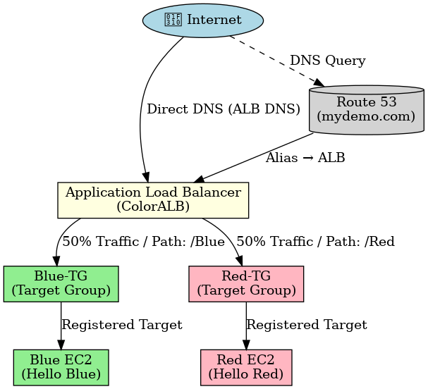

# AWS Application Load Balancer Demo (Blue/Red Deployment)

This project demonstrates how to set up an **Application Load Balancer (ALB)** on AWS to distribute traffic between two EC2 instances (Blue & Red servers).  
It also includes optional **Route 53 hosted routing**, where you can configure a fake domain for demo purposes or use a real domain if you own one.  

---

## Prerequisites
Before you begin, make sure you have:
- An **AWS Account** (Free Tier is enough).
- **IAM user** with administrator or EC2/ALB privileges.
- Basic knowledge of launching an **EC2 instance**.

---

## Architecture
The setup includes:
- **2 EC2 Instances**: Blue server & Red server.
- **Target Groups**: One for each server.
- **Application Load Balancer**: Distributes traffic.
- **Route 53 Hosted Zone** (optional): For domain-based routing.



---

### 1. Create the S3 Bucket
1. Go to **AWS Console → S3 → Create bucket**.  
2. Enter a **globally unique name**: e.g. `arr-bucket-123456`.  
3. Region: **us-east-1 (N. Virginia)** to match the lab setup.  
4. Keep **Block Public Access = ON** (recommended).  
   - EC2 will use an IAM role to fetch files (not public objects).  
5. Click **Create bucket**.  


---

### 2. Upload the Website Code
1. Prepare your local project so that it contains two folders: `red/` and `blue/`, each with its own `index.html`.  
2. In the **S3 Console**, open your bucket → click **Upload**.  
3. Make sure you only upload correct files & folders


---

## 3. Get Your Bucket ARN
1. In **S3 console** → open your bucket → go to **Properties**.  
2. Copy the ARNs: 
**For example:**
arn:aws:s3:::arr-bucket-123456 (bucket)  
arn:aws:s3:::arr-bucket-123456/* (all objects inside)  


---

## 4. Create IAM Policy for S3 Access
1. Create a JSON file `bucket-permissions.json` with:

```json
{
    "Version": "2012-10-17",
    "Statement": [
        {
            "Effect": "Allow",
            "Action": [
                "s3:GetObject"
            ],
            "Resource": "YOUR-BUCKET-ARN/*"
        }
    ]
}
```
➡ Replace `YOUR-BUCKET-ARN` with your actual bucket name.

## Console Method

1. Go to **IAM → Policies → Create Policy → JSON tab**.  
2. Paste the JSON above.  
3. Name it: **S3-ARR-Policy**.  


