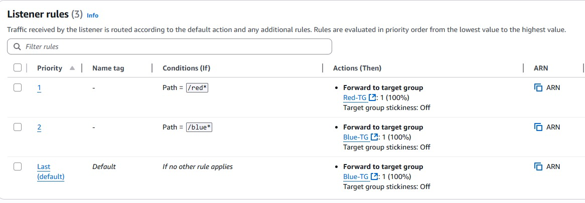
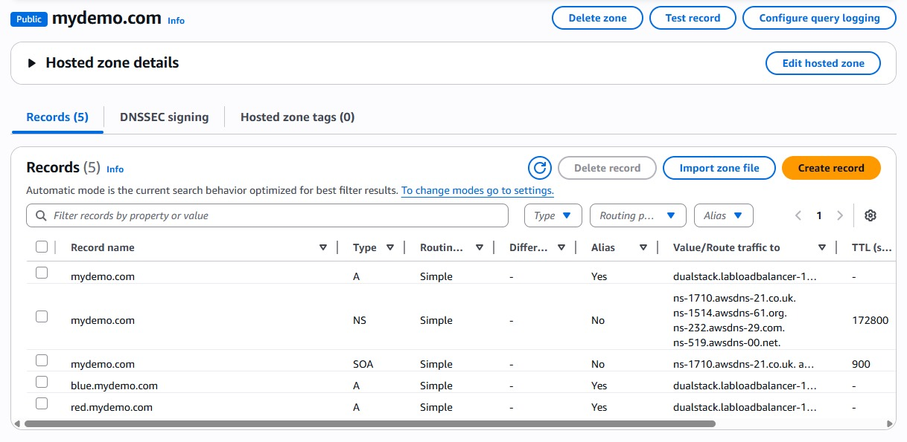

# AWS Application Load Balancer Demo (Blue/Red Deployment)

This project demonstrates how to set up an **Application Load Balancer (ALB)** on AWS to distribute traffic between two EC2 instances (Blue & Red servers).  
It also includes optional **Route 53 hosted routing**, where you can configure a fake domain for demo purposes or use a real domain if you own one.  

---

## Prerequisites
Before you begin, make sure you have:
- An **AWS Account** (Free Tier is enough).
- **IAM user** with administrator or EC2/ALB privileges.
- Basic knowledge of launching an **EC2 instance**.

---

## Architecture
The setup includes:
- **2 EC2 Instances**: Blue server & Red server.
- **Target Groups**: One for each server.
- **Application Load Balancer**: Distributes traffic.
- **Route 53 Hosted Zone** (optional): For domain-based routing.


---

### 1. Create the S3 Bucket
1. Go to **AWS Console → S3 → Create bucket**.  
2. Enter a **globally unique name**: e.g. `arr-bucket-123456`.  
3. Region: **us-east-1 (N. Virginia)** to match the lab setup.  
4. Keep **Block Public Access = ON** (recommended).  
   - EC2 will use an IAM role to fetch files (not public objects).  
5. Click **Create bucket**.  


---

### 2. Upload the Website Code
1. Prepare your local project so that it contains two folders: `red/` and `blue/`, each with its own `index.html`.  
2. In the **S3 Console**, open your bucket → click **Upload**.  
3. Make sure you only upload correct files & folders


---

### 3. Get Your Bucket ARN
1. In **S3 console** → open your bucket → go to **Properties**.  
2. Copy the ARNs: 
**For example:**
arn:aws:s3:::arr-bucket-123456 (bucket)  
arn:aws:s3:::arr-bucket-123456/* (all objects inside)  


---

### 4. Create IAM Policy for S3 Access
1. Create a JSON file `bucket-permissions.json` with:

```json
{
    "Version": "2012-10-17",
    "Statement": [
        {
            "Effect": "Allow",
            "Action": [
                "s3:GetObject"
            ],
            "Resource": "YOUR-BUCKET-ARN/*"
        }
    ]
}
```
➡ Replace `YOUR-BUCKET-ARN` with your actual bucket name.

#### Steps to create the IAM Policy

1. Go to **IAM → Policies → Create Policy → JSON tab**.  
2. Paste the JSON above.  
3. Name it: **S3-ARR-Policy**.  


##### CLI Method

```bash
aws iam create-policy --policy-name S3-ARR-Policy --policy-document file://bucket-permissions.json
```

---

### 5. Create IAM Role for EC2

1. Go to **IAM → Roles → Create role**.  
2. Select **AWS service → EC2**.  
3. Attach the policy: **S3-ARR-Policy**.  
4. Name it: **S3-ARR-Role**.  


##### CLI Method 

```bash
aws iam create-role --role-name S3-ARR-Role --assume-role-policy-document file://ec2-trust-policy.json
aws iam attach-role-policy --role-name S3-ARR-Role --policy-arn arn:aws:iam::123456789012:policy/S3-ARR-Policy
```

---

### 6. Prepare User Data Scripts

Name them: **user-data-red** and **user-data-blue**.  

Replace `YOUR-BUCKET-NAME` with your actual bucket name.  

Example commands:  

```bash
aws s3 cp --recursive s3://arr-bucket-123456/red /var/www/html/red
aws s3 cp --recursive s3://arr-bucket-123456/blue /var/www/html/blue
```

---

### 7. Launch EC2 Instances (Red & Blue)

1. Go to **EC2 → Instances → Launch Instance**.

2. **Choose AMI:**
   - Select **Amazon Linux 2 AMI** (Free tier eligible).

3. **Instance Type:**
   - Choose **t2.micro**.

4. **Key Pair:**
   - **Proceed without a key pair** or create a **key pair**.

5. **Network Settings:**
   - Allow **HTTP (80)** and **SSH (22)**.

6. **Advanced Details:**
   - IAM Instance Profile: Select **S3-ARR-Role**.
   - User Data: Paste the contents of:
     - `user-data-red` (for the Red instance), or
     - `user-data-blue` (for the Blue instance).

7. **Launch Instances:**
   - Launch **2 instances**: one Red and one Blue.


---

### 8. Create Target Groups

#### Task 1 – Create Your Target Groups
The first step is to set up the target groups; you need at least **2 target groups** to configure Path-based routing.  

1. Go to **EC2 → Target Groups** under **Load Balancing**.  
2. Click **Create target group**.  
3. Set up **2 target groups**:  
   - One called `Red-TG` which will contain the Red targets.  
   - One called `Blue-TG` which will contain the Blue targets.  
4. Leave all defaults, except update the **target group name** and configure **health checks**:  
   - For **Red-TG**: Health check path = `/red/index.html`  
   - For **Blue-TG**: Health check path = `/blue/index.html`  
5. Register the correct instances:  
   - Add the **Red instance** to **Red-TG** (be sure to click **include as pending below**).  
   - Add the **Blue instance** to **Blue-TG** (be sure to click **include as pending below**).  


##### Target Group 1 (Red)
- **Name:** `Red-TG`  
- **Protocol:** HTTP  
- **Port:** 80  
- **Health Check Path:** `/red/index.html`  
- **Register:** Red instance  

##### Target Group 2 (Blue)
- **Name:** `Blue-TG`  
- **Protocol:** HTTP  
- **Port:** 80  
- **Health Check Path:** `/blue/index.html`  
- **Register:** Blue instance  


---

### 9. Create Application Load Balancer

1. Go to **EC2 → Load Balancers → Create Load Balancer → Application Load Balancer**.  

- **Name:** `ColorALB`  
- **Scheme:** Internet-facing  
- **Listeners:** HTTP on port 80  
- **Availability Zones:** Select at least 2 subnets(the ones you used for your EC2s)  
- **Security Group:** Allow HTTP (80)  
- **Target Group:** Choose one (you will edit rules later)  


---

### 10. Configure ALB Listener Rules

#### Path-Based Routing

Once ALB is  active, under **Listeners and rules**, select the checkbox for your first listener.  
Then, under the **Manage Rules** menu, click **Add rule**.  

##### Configure as follows:  
- **Name and tags:** Ignore and click Next.  
- **Conditions:** Click **Add condition**, select **Path** from the dropdown menu, and enter `/red*` for the path.  
- **Actions:** Forward to the **Red target group**.  
- **Priority:** Set to **1**.  

Repeat the above creating a rule for the **Blue target group**:  
- Path should be `/blue*`.  
- Priority can be **2**.  

  

**Test:**  
Copy the **DNS name** from the Application Load Balancer and append either `/red` or `/blue` on the URL.  
You should see the different colored custom web pages we added to our instances.

- `http://<ALB-DNS>/red` → Red app 

 

- `http://<ALB-DNS>/blue` → Blue app  


### Host-Based Routing (Using Route 53 with a Fake Domain)

##### Step 1 – Open Route 53 and Create a Public Hosted Zone  
- Go to **Route 53 → Hosted Zones**.  
- Click **Create Hosted Zone**.  
- **Domain name:** `mydemo.com` (fake, you don’t need to own it).  
- **Type:** Public Hosted Zone.  
- Click **Create**.  


##### Step 2 – Create Subdomain Records (Blue & Red)  
Inside your `mydemo.com` hosted zone:  

1. Click **Create Record**.  
   - **Record name:** `blue` (this makes it `blue.mydemo.com`).  
   - **Record type:** A – Routes traffic to an IPv4 address or AWS resource.  
   - **Value/Route traffic to:**  
     - Choose **Alias → Application and Classic Load Balancer**.  
     - **Region:** Select the region where your ALB lives.  
     - **Target:** Select the ALB you created earlier (`ColorALB`).  
    - **Should look like this**

    

   - Click **Create record**.  

2. Repeat the same steps for `red.mydemo.com`:  
   - **Record name:** `red`.  
   - Everything else same as above, pointing to the same ALB. 

    

##### Step 3 – Create Apex/Naked Domain Record  
- Click **Create Record** again.  
- **Record name:** (leave blank → this maps to `mydemo.com` itself).  
- **Record type:** A.  
- **Alias:** Yes → point to the same ALB.  

 

- Save.  

##### Step 4 – Final DNS Records Layout  
Your hosted zone will now look like this:  

- `mydemo.com` → ALB  
- `red.mydemo.com` → ALB  
- `blue.mydemo.com` → ALB  

 

##### Step 5 – Add Host Header Rules to ALB Listener  

Now that Route 53 points traffic to the ALB, we need to tell the ALB how to forward requests for each subdomain.  

1. Go to **EC2 → Load Balancers → Select your ALB → Listeners tab**.  
2. Under **HTTP:80 listener**, click **View/edit rules**.  
3. Add two new rules:  
   - **Condition:** Host header = `red.mydemo.com` → **Action:** Forward to `Red-TG`.  
   - **Condition:** Host header = `blue.mydemo.com` → **Action:** Forward to `Blue-TG`.  

4. Save the rules.


**Test:**  
- `http://red.mydemo.com` → Red app  
- `http://blue.mydemo.com` → Blue app  

---

### 11. Troubleshooting Checklist

Even pros hit bumps on the road — here’s a quick list to keep your setup running smoothly:  

**Double-Check the Basics**  
- Did you replace **YOUR-BUCKET-NAME** in the user-data scripts?  
- Is the IAM role **S3-ARR-Role** properly attached to both EC2 instances?  

**Files & Permissions**  
- Do your IAM policies cover both the **bucket** and **bucket/*** (objects inside)?  
- Did you upload the correct folder structure (`red/`, `blue/`) into your S3 bucket?  

**On the Instances**  
- Check `/var/log/cloud-init-output.log` to confirm your S3 files copied over.  
- If the page doesn’t load, try `curl http://localhost` on the instance via SSH to test locally.  

**At the Load Balancer Level**  
- Are your listener rules (path or host-based) pointing to the right target groups?  
- Do your health checks show **healthy** targets in both groups?  

---

####  Conclusion  

Congrats — you’ve just built a **working Application Load Balancer demo** with both **path-based** and **host-based routing**!   

- You launched EC2 instances with user data scripts,  
- Configured target groups with health checks,  
- Set up an Application Load Balancer,  
- And routed traffic smartly using rules and DNS.  

If this felt a little challenging at times, that’s totally normal — you’re learning! The important part is that you now understand the pieces and how they fit together.  

As you keep practicing, you can try adding new features like HTTPS, weighted routing, or auto scaling. Each step builds your confidence and gets you closer to running real-world architectures.  

**Well done — you took on a complex AWS service and made it work. That’s a big win!**

### Author
**Belinda Ntinyari** – [Medium](https://medium.com/@ntinyaribelinda) | [LinkedIn](https://www.linkedin.com/in/belinda-ntinyari/)

---

### License
This project is licensed under the [MIT License](https://opensource.org/licenses/MIT).
